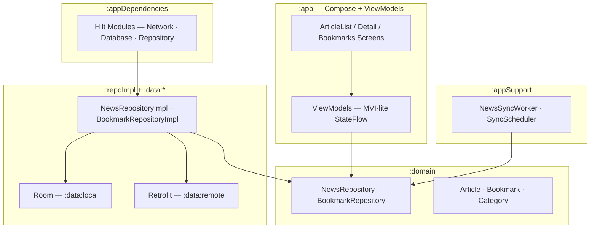

# News Digest

News Digest is an Android app that fetches top headlines from [NewsAPI.org](https://newsapi.org/),
caches them locally with Room for offline reading, lets users bookmark articles, and periodically
syncs in the background via WorkManager to notify users when new articles arrive.

## How to build and run

### Prerequisites

| Requirement       | Version                                                    |
|-------------------|------------------------------------------------------------|
| JDK               | 17                                                         |
| Android SDK       | compileSdk **37** (install via Android Studio SDK Manager) |
| Android Studio    | Koala (2024.1.1) or newer recommended                      |
| minSdk            | 26                                                         |
| Device / emulator | API 26+ for install; API 34+ recommended for manual QA     |

### 1. Configure the API key

1. Register for a free developer key at [newsapi.org/register](https://newsapi.org/register).
2. Create `local.properties` at the **repo root** (same directory as `settings.gradle.kts`):

```properties
NEWS_API_KEY=your_key_here
```

**Do not wrap the value in quotes.** The key is read at build time and injected into `:data:remote`
as `BuildConfig.NEWS_API_KEY` for the `ApiKeyInterceptor`.

`local.properties` is gitignored — never commit your API key.

### 2. Build

```bash
# Build all debug variants (11 modules)
./gradlew assembleDebug
```

### 3. Install and launch

Connect a device or start an emulator, then:

```bash
./gradlew :app:installDebug
```

Launch **News Digest** (`com.app.newsdigest`) from the device. On first launch (Android 13+), the
app requests notification permission so background sync can surface new-article alerts.

Alternatively, open the project in Android Studio and run the **app** configuration.

### 4. Run tests (optional)

```bash
# Unit tests — all modules (debug variant)
./gradlew testDebugUnitTest

# Instrumented Compose smoke tests — requires a running emulator or device
./gradlew :app:connectedDebugAndroidTest
```

Modules with unit tests: `:app`, `:domain`, `:repoImpl`, `:data:local`, `:data:remote`,
`:design-system`, `:appSupport`.

### Design system catalog (optional)

The **design-system catalog** is a standalone gallery app for tokens and Compose components — useful
for visual QA without running the full product app.

```bash
./gradlew :design-system-catalog:installDebug
```

Package: `com.app.designsystem.catalog`

Gallery sections: Foundation, Buttons, Inputs, Badges, Cards, Navigation, and News components (
`ArticleCard`, `ErrorState`, `LoadingState`).

For token tables, component inventory, and fidelity rules, see [
`design-system/README.md`](design-system/README.md).

## Architectural decisions

The app follows layered Clean Architecture with MVVM-style unidirectional state. The choices below
are intentional trade-offs for a small, testable codebase — not accidental omissions.



### Decisions and rationale

| Decision                                                  | Rationale                                                                                                                                                                                                                 |
|-----------------------------------------------------------|---------------------------------------------------------------------------------------------------------------------------------------------------------------------------------------------------------------------------|
| **Repository-centric domain — no UseCase layer**          | ViewModels and `NewsSyncWorker` inject `NewsRepository` / `BookmarkRepository` directly. At this scope, repository methods map 1:1 to user actions; a UseCase layer would add indirection without meaningful reuse.       |
| **`:appDependencies` as the sole DI and data wiring hub** | `:app` never imports `:repoImpl`, `:data:local`, or `:data:remote`. Presentation stays testable against domain interfaces; swapping data sources is a Gradle-only change in one module.                                   |
| **Offline-first — Room is the UI source of truth**        | API responses are persisted immediately; screens observe `Flow<List<Article>>` from the cache. When refresh fails but cached data exists, users see stale content with an offline banner instead of a full-screen error.  |
| **`Result<T>` at repository boundaries**                  | Failures are explicit and typed. ViewModels branch on success vs. error without try/catch at every call site. `ConnectivityMonitor` differentiates device-offline from server errors for clearer copy.                    |
| **Dedicated `:design-system` module**                     | Tokens and Compose primitives live outside `:app` so the catalog app and product screens share one visual language. `:app` depends on it directly (not via `:appDependencies`) because it is UI infrastructure, not data. |
| **Platform code isolated in `:appSupport`**               | WorkManager sync, notifications, and connectivity monitoring stay out of repositories and ViewModels. Workers still depend only on domain interfaces.                                                                     |
| **MVI-lite unidirectional state**                         | Each screen exposes a `StateFlow` UI state and accepts intents. One-shot effects (snackbars, share sheet, open-in-browser) use `Once<T>` collected at the NavHost to avoid duplicate handling on rotation.                |
| **`Theme { }` applied once at the NavHost root**          | Single theme boundary in `NavGraph.kt` keeps typography and color consistent across Article List, Detail, and Bookmarks without per-screen wrapping.                                                                      |
| **Periodic background sync via WorkManager**              | A unique periodic `NewsSyncWorker` (every 4 hours, network-required) detects new articles and posts a notification with a deep link back to Article List — decoupled from foreground refresh.                             |

### Module overview

| Module                   | Package / namespace              | Role                                                                                     |
|--------------------------|----------------------------------|------------------------------------------------------------------------------------------|
| `:app`                   | `com.app.newsdigest`             | Compose screens, ViewModels, `NavGraph`, `MainActivity`, `NewsDigestApplication`         |
| `:appDependencies`       | `com.app.newsdigest.di`          | Hilt DI hub — wires `:repoImpl`, `:data:*`, `:appSupport`; sole composer of data modules |
| `:domain`                | `com.app.newsdigest.domain`      | Pure Kotlin models, repository interfaces, fakes                                         |
| `:repoImpl`              | `com.app.newsdigest.repo`        | Offline-first repository implementations and mappers                                     |
| `:data:local`            | `com.app.newsdigest.data.local`  | Room database, entities, DAOs                                                            |
| `:data:remote`           | `com.app.newsdigest.data.remote` | Retrofit `NewsApiService`, DTOs, `ApiKeyInterceptor`                                     |
| `:appSupport`            | `com.app.newsdigest.support`     | WorkManager sync, notifications, `ConnectivityMonitor`                                   |
| `:common`                | `com.app.newsdigest.concurrency` | `AppDispatchers`, coroutine scope helpers                                                |
| `:utils`                 | `com.app.newsdigest.support`     | `Result<T>`, `Once<T>`, `Logger`, `ResultResolver`                                       |
| `:design-system`         | `com.app.designsystem`           | Design tokens, `Theme`, reusable Compose components                                      |
| `:design-system-catalog` | `com.app.designsystem.catalog`   | Dev-only component gallery (not shipped)                                                 |

### Project layout

```
app/
  src/main/java/com/app/newsdigest/
    presentation/
      articlelist/     # Article List screen + ViewModel
      detail/          # Article Detail screen + ViewModel
      bookmarks/       # Bookmarks screen + ViewModel
      navigation/      # NavGraph, AppRoutes, deep links
      common/          # Snackbar helpers, error mapping, external intents
    MainActivity.kt
    NewsDigestApplication.kt
domain/                # Models, repository interfaces, fakes
repoImpl/              # Repository implementations, mappers
data/local/            # Room entities, DAOs, AppDatabase
data/remote/           # Retrofit API, DTOs, BuildConfig API key
appDependencies/       # Hilt modules (Network, Database, Repository, Support)
appSupport/            # NewsSyncWorker, SyncScheduler, notifications, connectivity
design-system/         # Tokens, Theme, Compose components
design-system-catalog/ # Component gallery app
common/                # AppDispatchers, coroutine extensions
utils/                 # Result, Once, Logger
```

## Screens

### Article List (`article_list`)

Start destination. Loads top headlines by category (General, Business, Technology, Sports, Health,
Science) from NewsAPI, displays them from Room cache, and supports pull-to-refresh. Shows loading
skeletons, empty-category, error, and offline-stale states. Bookmark toggle persists to Room;
failures surface a snackbar.

### Article Detail (`article_detail/{articleId}`)

Reads the article from the Room cache (offline-capable). Supports bookmark toggle, share sheet, and
open-in-browser. Loading skeleton, error + retry, and bookmark-failure snackbar patterns match
Article List.

### Bookmarks (`bookmarks`)

Room-only list of saved articles with empty state and CTA back to Article List. Remove-bookmark
failures show a snackbar. No network banner — bookmarks are always available offline.

## Future improvements

Given more time, these are the areas I would prioritize next:

| Area                  | Improvement                                                                                                                                                                      |
|-----------------------|----------------------------------------------------------------------------------------------------------------------------------------------------------------------------------|
| **Theming**           | Dark mode and dynamic color support in `Theme`                                                                                                                                   |
| **Search**            | NewsAPI `/v2/everything` integration with debounced query and cursor-based pagination                                                                                            |
| **Navigation**        | Settings drawer, category preferences, and deep links to article detail from notifications                                                                                       |
| **Notifications**     | Per-category grouping, richer styles, and actionable dismiss                                                                                                                     |
| **Detail resilience** | Network fallback when an article is not yet cached (e.g. opened from a share link)                                                                                               |
| **List performance**  | Paging 3 for long article feeds; image cache tuning                                                                                                                              |
| **UX**                | Smoother transitions and scroll behavior, haptic feedback on bookmark toggle, improved accessibility (content descriptions, TalkBack), and polish for loading/empty/error states |
| **Code organization** | Extract shared list chrome (`AppBar`, bottom nav, section tabs) from feature packages into a shared presentation module                                                          |

**Current MVP scope** (intentionally deferred): light mode only; search and menu toolbar actions
show
placeholder snackbars; single notification per sync batch; NewsAPI free-tier rate limits apply.

## Commands cheat sheet

```bash
# Configure API key first — see "How to build and run" above
echo 'NEWS_API_KEY=your_key' >> local.properties

# Build everything
./gradlew assembleDebug

# Run main app on connected device
./gradlew :app:installDebug

# Design system gallery
./gradlew :design-system-catalog:installDebug

# Unit tests (all modules)
./gradlew testDebugUnitTest

# Instrumented tests (emulator)
./gradlew :app:connectedDebugAndroidTest
```

## License / contributing

No license file is included yet. Contributions welcome via pull request.
